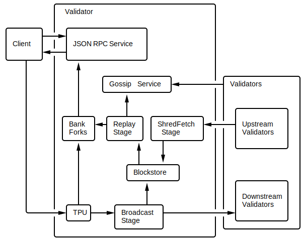

## Anatomy of a Validator

### Pipelining(流水线)
这些验证器广泛使用了CPU设计中常见的一种优化，称为*Pipelining*。当输入数据流需要通过一系列步骤进行处理，并且每个步骤由不同的硬件负责时，Pipelining 是合适的工具。最典型的例子就是用洗衣机和烘干机来洗/干/叠几堆衣服。在干燥之前必须进行洗涤，在折叠之前必须进行干燥，但这三种操作的每一种都由一个单独的单元执行。为了最大限度地提高效率，我们需要建立一个由stage 组成的pipeline。我们称洗洗衣机为第一步，烘干机为第二步，折叠工序为第三步。要运行这条pipeline，在第一批衣物加入烘干机之后，就会将第二批衣物加入洗衣机。同样地，在第二件衣物放入烘干机、第一件衣物被折叠后，第三件衣物被放入洗衣机。这样，一个人可以同时洗三次衣服。给定无限负载，pipeline将始终以pipeline中最慢阶段的速率完成负载。

### Validator中的流水线(Pipelining in the Validator)
Validator 中包含了两个pipeline 程序，一个在 Leader 模式下使用，叫做 TPU，一个在 validator 模式下使用，叫TVU。在这两种情况下，流水线化的硬件是相同的，包括网络输入、GPU卡、CPU内核、写入磁盘和网络输出。它对硬件的作用是不同的。TPU的存在是为了创建分类账条目，而TVU的存在是为了验证它们。

