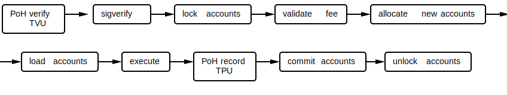

## 运行时

### 运行时(The Runtime)
The Runtime是一个并发事务处理器。事务预先指定其数据依赖关系，动态内存分配是显式的。通过将程序代码与它所操作的状态分离，运行时能够编排并发访问。只访问只读帐户的事务是并行执行的，而访问可写帐户的事务是序列化的。运行时通过带有定义良好的接口的入口点与程序交互。存储在帐户中的数据是一种不透明类型，是一个字节数组。程序对它的内容有完全的控制。

该事务结构指定了公钥列表和这些密钥的签名，以及将在与帐户密钥相关的状态上操作的顺序指令列表。对于要提交的事务，所有指令必须成功执行;如果有任何中止，则整个事务无法提交。

##### 帐户结构
帐户维护一个lamport balance 和特定于程序的内存。

### 交易引擎
该引擎将公钥映射到帐户，并将它们路由到程序的入口点。

#### 执行
事务在pipeline 中进行批处理和处理。TPU和TVU的路线略有不同。TPU运行时确保在提交内存之前出现 PoH 记录。

TVU运行时确保在运行时处理任何事务 之前进行 PoH 验证。



在运行阶段，所加载的帐户没有数据依赖关系，所以所有的程序都可以并行执行。

The runtime强制执行以下规则:
    1. 只有所有者程序可以修改帐户的内容。这意味着在赋值时数据向量保证为零。
    2. 所有账户的总余额在交易执行之前和之后是相等的
    3. 事务执行后，只读帐户的余额必须等于事务之前的余额。
    4. 事务中的所有指令都以原子方式执行。如果有一个失败，所有的帐户修改都将被丢弃。

程序的执行涉及到将程序的公钥映射到一个入口点，该入口点接受一个指向事务的指针和一个已加载帐户的数组。

#### 系统程序接口
接口最好由用户编码的```Instruction::data```来描述。
    * ```CreateAccount```: 这允许用户使用已分配的数据数组创建一个帐户，并将其分配给程序.
    * ```CreateAccountWithSeed```: 和```CreateAccount```相同，但是新账户的地址派生于：
        - 资金账户的pubkey
        - 一个助记字符串(种子)，和
        - 程序的pubkey
    * ```Assign```： 允许用户将现有帐户分配给程序。
    * ```Transfer```： 账户间的转账。

#### 程序状态安全(Program State Security)
为了让区块链正常工作，程序代码必须对用户输入具有弹性。这就是为什么在这个设计中，特定于程序的代码是唯一可以改变分配给它的帐户中的数据字节数组状态的代码。这也是为什么```Assign```或```CreateAccount```必须将数据归零的原因。否则，如果没有运行时提供的额外元数据来表明该内存是分配的，而不是本机生成的，程序就无法将最近分配的帐户数据与本机生成的状态转换区分开。

为了在程序之间传递消息，接收程序必须接受消息并复制该状态。但在实践中，不需要副本，也不可取。接收程序可以读取属于其他帐户的状态而不复制它，并且在读取过程中保证了它对发送程序的状态。

#### 注意(Notes)
* 没有动态内存分配。没有动态内存分配。客户端需要使用```CreateAccount```指令创建内存，然后再将其传递给另一个程序。这个指令可以通过调用程序本身组成一个事务。
* ```CreateAccount``` 和 ```Assign```确保当帐户被分配给程序时，帐户的数据初始化为零。
* 将帐户分配给程序或分配空间的交易必须由帐户地址的私钥签名，除非帐户是由```CreateAccountWithSeed```创建的，在这种情况下没有对应帐户地址/pubkey的私钥。
* 一旦分配给程序，帐户就不能再被分配。
* Runtime 确保程序代码是唯一可以修改Account所分配给的Account数据的代码。
* Runtime 确保程序只能使用分配给它的帐户中的lamports。
* Runtime 确保属于账户的余额是在交易前后平衡的
* Runtime 确保提交事务时，所有指令都成功执行。

### Future Work
- [用于长时间运行事务的延续和信号](https://github.com/solana-labs/solana/issues/1485)
- Continuations and Signals for long running Transactions