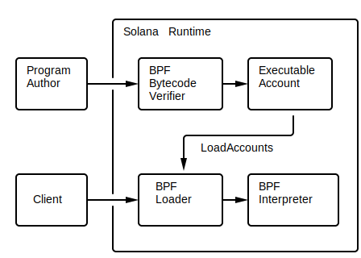

## 部署

如上图所示，程序作者创建一个程序，将其编译为包含BPF字节码的ELF共享对象，然后通过一个特殊的部署事务将其上传到Solana集群。集群通过程序ID使其对客户机可用。程序ID是部署时指定的地址，用于在后续事务中引用程序。

在成功部署之后，持有程序的帐户被标记为可执行的，并且其帐户数据成为永久不可变的。如果需要对程序进行任何更改(功能、补丁等)，则新程序必须部署到一个新的程序ID。

Solana命令行接口支持部署程序，更多信息请参见[部署](https://docs.solana.com/cli/usage#deploy-program)命令行使用文档。